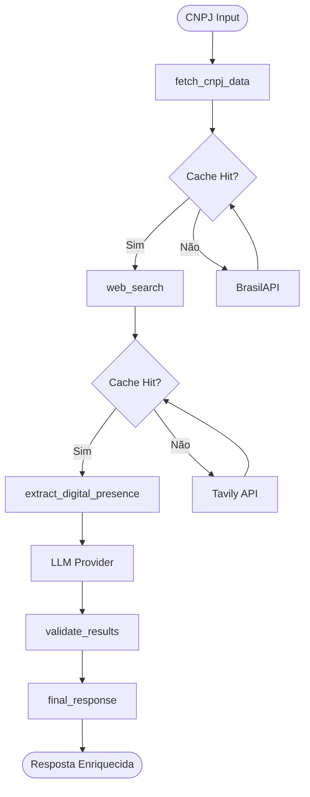

# Arquitetura do Sistema

## Visão Geral

O sistema é composto por três camadas principais:

1. **Backend (NestJS)**: API REST com agente LangGraph, persistência em PostgreSQL e logs estruturados
2. **Frontend (Next.js)**: Interface web estilo ChatGPT, tema dark e experiência focada em CNPJ
3. **Infraestrutura**: Docker, Redis, PostgreSQL

## Arquitetura do Agente

### Camadas de Processamento

```
┌─────────────────────────────────────┐
│  Camada 1: Dados Oficiais           │
│  (BrasilAPI/OpenCNPJ)               │
│  - Determinística                    │
│  - Cache: 24h                       │
└─────────────────────────────────────┘
              ↓
┌─────────────────────────────────────┐
│  Camada 2: Busca Web                │
│  (Tavily Search API)                 │
│  - Sempre executada                 │
│  - Cache: 6h                        │
└─────────────────────────────────────┘
              ↓
┌─────────────────────────────────────┐
│  Camada 3: Extração com IA           │
│  (LLM Provider)                      │
│  - Validação rigorosa                │
│  - Anti-alucinação                   │
└─────────────────────────────────────┘
              ↓
┌─────────────────────────────────────┐
│  Camada 4: Normalização              │
│  - Consolidação                      │
│  - Validação de fontes               │
│  - Formatação final                  │
└─────────────────────────────────────┘
```

## Fluxo de Dados



## Estado do Agente

O estado é tipado e imutável:

```typescript
interface AgentState {
  cnpj: string;                     // CNPJ limpo (apenas números)
  dadosOficiais?: DadosOficiais;    // Dados da BrasilAPI/OpenCNPJ
  webResults?: SearchResult[];      // Resultados da Tavily filtrados (score >= 0.8)
  digitalPresence?: DigitalPresence;// Dados extraídos pela IA (site, email, instagram, logo)
  fontes: string[];                 // Lista de todas as fontes usadas
  requestId?: string;               // UUID para rastreamento ponta-a-ponta
  conversationId?: string;          // ID da conversa atual
  tokensUsed?: number;              // Tokens consumidos (real ou estimado)
}
```

## Decisões Arquiteturais

### 1. LangGraph para Orquestração

**Decisão**: Usar LangGraph em vez de workflows manuais

**Razão**: 
- Fluxo complexo com múltiplas etapas
- Necessidade de estado compartilhado
- Facilita evolução futura (multi-agentes)

### 2. Cache Agressivo

**Decisão**: Cache obrigatório antes de chamadas externas

**Razão**:
- Reduz custos de APIs externas
- Melhora performance
- Dados oficiais raramente mudam

### 3. Busca Web Sempre Executada

**Decisão**: Sempre executar busca web, mesmo sem resultados

**Razão**:
- Garantir completude dos dados
- Não perder informações de presença digital
- Feature flag permite desabilitar se necessário

Adicionalmente:

- Resultados da Tavily são **filtrados por score >= 0.8** para reduzir ruído.
- Resultados são priorizados para o LLM conforme heurísticas de "site oficial".

### 4. Anti-Alucinação Rigorosa

**Decisão**: Retornar `null` em vez de dados inventados

**Razão**:
- Precisão > Completude
- Dados auditáveis
- Confiança do usuário

### 5. TypeScript Estrito

**Decisão**: TypeScript com strict mode

**Razão**:
- Detecção precoce de erros
- Melhor autocomplete
- Documentação implícita

### 6. Persistência de Conversas e Logs

**Decisão**: Persistir conversas e execuções do agente em PostgreSQL.

**Razão**:
- Permitir reabrir conversas antigas.
- Fornecer observabilidade completa (mensagens, execuções, buscas Tavily).
- Base para futuras análises (auditoria, métricas de uso, custo por requisição).

Entidades principais:

- `Conversation` – metadados da conversa (id, título, timestamps, soft delete).
- `Message` – mensagens individuais (`role`, `content`, `metadata`, `createdAt`).
- `AgentExecutionLog` – logs de execuções do agente (enrich/chat, estado, tokens).
- `TavilySearchLog` – logs das buscas Tavily (termo, resultados, cache, sucesso/erro).

## Integrações Externas

### BrasilAPI

- **Endpoint**: `/api/cnpj/v1/{cnpj}`
- **Rate Limit**: Não documentado (usar com moderação)
- **Cache**: 24 horas

### Tavily Search API

- **Endpoint**: `https://api.tavily.com/search`
- **Rate Limit**: Depende do plano
- **Cache**: 6 horas

### LLM Providers

Suporta três providers:

1. **OpenAI**: `gpt-4o-mini` (padrão)
2. **Anthropic**: `claude-3-haiku-20240307`
3. **Google**: `gemini-pro`

Quando o provider não retorna metadados de uso (tokens), o sistema calcula uma
**estimativa de tokens** a partir do tamanho do prompt + resposta, para registrar
`tokensUsed` nos logs.

## Segurança

### Validação de Entrada

- Validação de formato de CNPJ
- Sanitização de dados
- Rate limiting (futuro)

### Tratamento de Erros

- Erros não expõem informações sensíveis
- Logs estruturados para debugging
- Fallbacks graciosos

## Performance

### Otimizações

- Cache em múltiplas camadas
- Queries paralelas quando possível
- Timeout configurável para APIs externas

### Métricas

- Tempo de resposta médio: < 5s
- Cache hit rate: > 80% (esperado)
- Taxa de erro: < 1%

## Escalabilidade

### Horizontal

- Stateless backend (pode escalar horizontalmente)
- Redis compartilhado para cache
- Load balancer compatível

### Vertical

- Processamento assíncrono
- Stream de respostas (futuro)
- Batch processing (futuro)

## Monitoramento

### Logs

- Estruturados com `requestId` e `conversationId`
- Níveis: error, warn, log, debug
- Logs de:
  - Mensagens (`Message`)
  - Execuções do agente (`AgentExecutionLog`)
  - Buscas Tavily (`TavilySearchLog`)
- Endpoints REST para inspeção:
  - `GET /logs/messages/:conversationId`
  - `GET /logs/agent` (com filtros)
  - `GET /logs/tavily` (com filtros)

### Métricas

- Tempo de execução por etapa
- Taxa de cache hit
- Taxa de erro por provider
- Custo por requisição (futuro)

## Evoluções Futuras

1. **Multi-agentes**: Agentes especializados por tipo de dado
2. **Streaming**: Respostas em tempo real
3. **Avaliação Automática**: LangSmith para qualidade
4. **Histórico de Decisões**: Audit trail completo
5. **Scraping Controlado**: Para sites específicos
