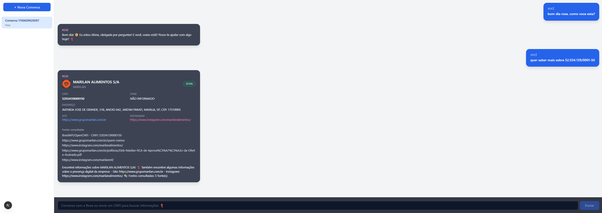

# 🌹 Rose – Agente de Enriquecimento de CNPJ com IA

Sistema completo para enriquecer dados de CNPJ utilizando **dados oficiais**, **busca web filtrada** (score ≥ 0.8) e uma **IA conversacional** com personalidade Rose, com persistência em banco de dados e observabilidade de ponta a ponta.



---

## 🔎 Visão Geral

- **Rose**: assistente especializada em CNPJ, responde de forma natural e amigável.
- **Backend (NestJS + LangGraph)**: orquestra BrasilAPI/OpenCNPJ, Tavily e LLM.
- **Frontend (Next.js + Tailwind)**: interface de chat em tema dark, estilo ChatGPT.
- **Persistência (PostgreSQL)**: conversas, mensagens e logs de execuções.
- **Cache (Redis)**: otimiza chamadas externas.
- **Docker Compose**: sobe todo o stack (Redis, PostgreSQL, backend, frontend).

Para detalhes de arquitetura, consulte `ARCHITECTURE.md`.

---

## 🧱 Tecnologias Principais

- **Backend**
  - NestJS + TypeScript
  - LangGraph / LangChain (orquestração do agente)
  - TypeORM + PostgreSQL
  - Redis para cache
- **Frontend**
  - Next.js 16.1.4 (App Router)
  - React + Tailwind CSS (tema dark)
- **IA / Integrações**
  - LLM: OpenAI (padrão), Anthropic, Google Gemini (configurável)
  - Tavily Search API (busca web focada)
  - BrasilAPI / OpenCNPJ (dados oficiais do CNPJ)

---

## 📋 Pré‑requisitos

- **Node.js 18+**
- **npm** (ou outro gerenciador compatível)
- **Docker** e **Docker Compose**
- Contas/API Keys:
  - `TAVILY_API_KEY`
  - `OPENAI_API_KEY` (ou outro provider, se for usar `LLM_PROVIDER` ≠ `openai`)

---

## 🔐 Configuração de Ambiente

### 1. Variáveis do Backend (`backend/.env`)

Na pasta `backend`, use o exemplo existente:

```bash
cp backend/.env.example backend/.env
```

Edite `backend/.env` e configure ao menos:

```env
PORT=3001

REDIS_HOST=localhost
REDIS_PORT=6379

POSTGRES_HOST=localhost
POSTGRES_PORT=5432
POSTGRES_USER=postgres
POSTGRES_PASSWORD=postgres
POSTGRES_DB=rose_cnpj

BRASIL_API_URL=https://brasilapi.com.br/api/cnpj/v1

TAVILY_API_KEY=SEU_TAVILY_API_KEY_AQUI
OPENAI_API_KEY=SEU_OPENAI_API_KEY_AQUI
LLM_PROVIDER=openai
```

> Quando rodar via Docker Compose, `REDIS_HOST` e `POSTGRES_HOST` serão sobrescritos para `redis` e `postgres` pelo próprio `docker-compose.yml`.

### 2. Variáveis do Frontend (`frontend/.env`)

Na pasta `frontend`, use o exemplo existente:

```bash
cp frontend/.env.example frontend/.env
```

Edite `frontend/.env` e configure:

```env
NEXT_PUBLIC_API_URL=http://localhost:3001
```

---

## ▶️ Rodando em Ambiente de Desenvolvimento (sem Docker)

### 1. Backend (NestJS)

```bash
cd backend
npm install        # ou npm ci
npm run start:dev  # inicia em http://localhost:3001
```

Certifique‑se de que:

- Redis está rodando em `localhost:6379` (pode ser via Docker isolado).
- PostgreSQL está rodando em `localhost:5432` com o banco configurado (`rose_cnpj`).

Se quiser subir Redis/PostgreSQL rapidamente com Docker apenas para dev:

```bash
docker compose up -d redis postgres
```

### 2. Frontend (Next.js)

Em outro terminal:

```bash
cd frontend
npm install        # ou npm ci
npm run dev        # inicia em http://localhost:3000
```

Acesse:

- Frontend: `http://localhost:3000`
- Backend (API): `http://localhost:3001`

---

## 🐳 Rodando Tudo com Docker Compose

Na raiz do projeto:

```bash
docker compose up --build
```

Isso irá subir:

- `redis` em `localhost:6379`
- `postgres` em `localhost:5432`
- `backend` NestJS em `http://localhost:3001`
- `frontend` Next.js em `http://localhost:3000`

> As variáveis sensíveis (API keys) devem estar definidas no seu ambiente ou em arquivos `.env` que o Docker Compose lê (por exemplo, na shell antes de rodar o comando).

### Comandos úteis

- Subir em segundo plano:
  ```bash
  docker compose up -d --build
  ```
- Ver logs:
  ```bash
  docker compose logs -f backend
  docker compose logs -f frontend
  ```
- Parar tudo:
  ```bash
  docker compose down
  ```

---

## 💬 Fluxo de Uso da Aplicação

1. Abra o frontend em `http://localhost:3000`.
2. Clique em uma conversa existente ou crie uma nova.
3. Envie:
   - Um **CNPJ** (com ou sem pontuação) para enriquecimento de dados; ou
   - Uma mensagem livre para conversar com a **Rose**.
4. A Rose responde e, quando for CNPJ, exibe um **card detalhado** com:
   - Razão social, nome fantasia, situação, endereço, CNAE.
   - Site, e‑mail, Instagram.
   - Logo (via favicon quando disponível).
   - Fontes consultadas.
5. Todo o histórico é persistido no banco de dados e pode ser reaberto depois.

---

## 📊 Observabilidade e Logs

O backend registra:

- **Mensagens**: tabela `messages` (por conversa).
- **Execuções do agente**: tabela `agent_execution_logs` (inclui `tokensUsed`, operação, estado, provider/model).
- **Buscas Tavily**: tabela `tavily_search_logs` (termo, resultados, cache, sucesso/erro).

Endpoints úteis (backend):

- `GET /logs/messages/:conversationId` – histórico de mensagens de uma conversa.
- `GET /logs/agent?conversationId=...` – execuções do agente para uma conversa.
- `GET /logs/tavily?conversationId=...` – buscas web associadas a uma conversa.

---

## 🧩 Estrutura de Pastas (Resumo)

```text
.
├─ backend/                  # API NestJS + agente
│  ├─ src/
│  │  ├─ modules/
│  │  │  ├─ agent/           # Lógica do agente e prompts da Rose
│  │  │  ├─ conversations/   # Entidade e serviço de conversas
│  │  │  ├─ logging/         # Entidades e serviço de logs
│  │  │  └─ tools/           # Tavily, BrasilAPI/OpenCNPJ etc.
│  ├─ Dockerfile
│  └─ .env.example
│
├─ frontend/                 # App Next.js (chat)
│  ├─ app/
│  │  ├─ chat/
│  │  │  ├─ [conversationId]/page.tsx
│  │  │  └─ components/      # ChatWindow, ChatList, Message
│  │  ├─ layout.tsx
│  │  └─ page.tsx
│  ├─ Dockerfile
│  └─ .env.example
│
├─ docker-compose.yml
├─ ARCHITECTURE.md
└─ README.md
```

---

## ❗ Troubleshooting Rápido

- **Frontend mostra “Network Error”**:
  - Verifique se o backend está rodando em `http://localhost:3001`.
  - Confirme `NEXT_PUBLIC_API_URL` no `frontend/.env`.
- **Sem tabelas no PostgreSQL**:
  - Garanta que o backend iniciou sem erro de conexão.
  - Verifique se `POSTGRES_*` no `backend/.env` bate com as credenciais do container/instância.
- **Redis/Postgres não sobem no Docker**:
  - Rode `docker compose ps` e `docker compose logs redis postgres` para ver o motivo.

---

## 📚 Mais Detalhes

- Arquitetura completa e decisões: `ARCHITECTURE.md`.
- Dockerfiles individuais: `backend/Dockerfile`, `frontend/Dockerfile`.
- Para dúvidas sobre fluxo de dados, estado do agente ou logs, veja os módulos em `backend/src/modules`.
